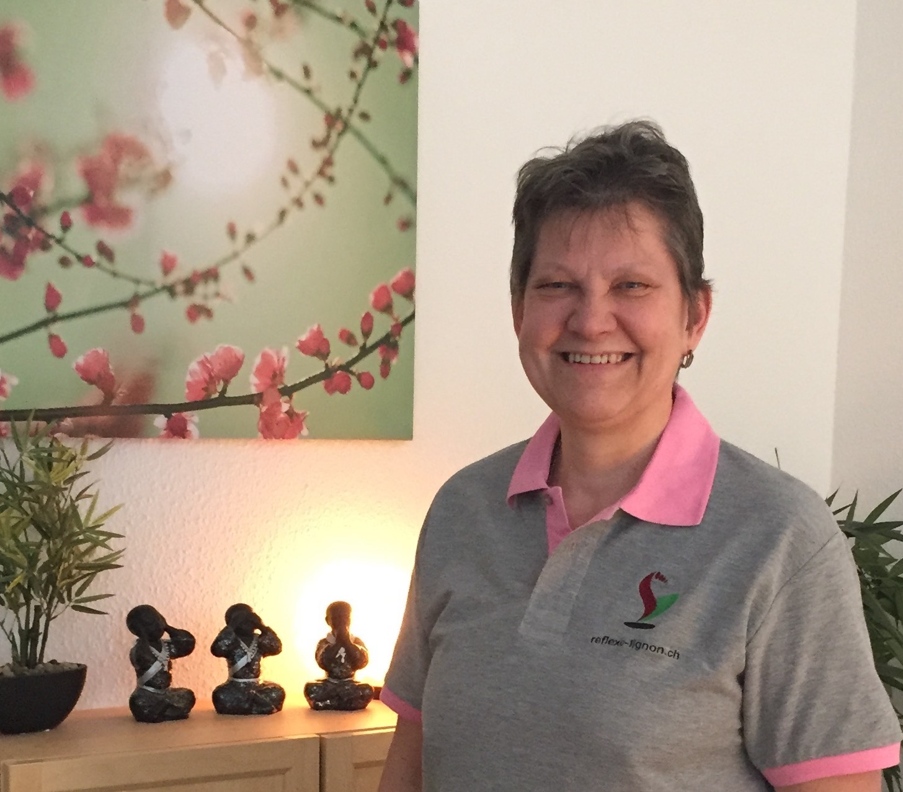

# Réflexo Lignon

## Suzanne Himmelberger

## Bienvenue



# ‼️ Covid 19, Fermeture temporaire du cabinet de réflexologie ‼️ #

Après beaucoup de réflexion, la situation concernant le COVID 19 qui évolue extrêmement rapidement, la sagesse m’a fait prendre la décision de fermer mon cabinet de réflexologie, le temps que cette pandémie se calme un peu. Il est très important d’être tous solidaires et protéger toutes les personnes à risque ainsi que nos aînés. Je pense également à tout le personnel soignant.
Je ne manquerai pas de vous tenir informé(e)s de la réouverture du cabinet. A très bientôt.
Portez-vous bien 🙏

{: style="margin-top:50px;margin-bottom:50px;" }

## Réflexo-Lignon, espace de détente et bien-être.

[La réflexologie plantaire](./reflexologie) permet entre autres de soulager les maux du quotidien et d’éliminer les tensions dues au stress.

[La réflexologie spécifique en cas de troubles du sommeil](./reflexologie) consiste à rééquilibrer l’organisme en stimulant les zones reflexes concernées, dans le but d’améliorer les symptomes, et de retrouver un sommeil plus réparateur.

[La réflexologie palmaire](./autres_soins) est une vraie séance de réflexologie appliquée sur les mains, n’hésitez pas à découvrir cette méthode trop peu connue.

[La réflexologie de la boîte crânienne](./autres_soins) permet de soulager insomnies, stress, préoccupations et autres.

[Reflexo-Dos](./autres_soins) — La réflexologie combinée avec le massage assis.

En plus, j’ai une spécialisation de [réflexologie en oncologie](./oncologie). Il s’agit d’un soin de support pour accompagner les personnes atteintes du cancer en soulageant les douleurs et effets secondaires des traitements.

[Soins énergétiques](./soins_énergétiques)

- *Access Bars* : 32 points stimulés en douceur sur la tête.
- Lifting facial énergétique : Sans aiguilles ni produits, donne un aspect “coup d’éclat” au visage.
- Réflexologie amérindienne : Tout sauf à quoi on s’attend dans une réflexologie mais grâce à celà : bien plus que l’on osait espérer !

## Nouveau

Commandez votre "bon cadeau" en ligne !

[{: style="margin-top:20px; margin-bottom:20px; width:357px" }](./bons-cadeaux)

## Témoignage

*Une heure de pure détente suivie de nombreux jours soulagée de mes petits bobos. Suzanne a des doigts de fée, un vrai bonheur, même quand elle touche un point sensible, le soulagement et le bien-être arrivent très vite. Merci Suzanne.*

[Autres témoignages](./temoignages)

## Bon à savoir

Étant une spécialiste agréée par l’[*ASCA*](http://www.asca.ch/dc.aspx?content=Assureurs_conventionnes), mes séances sont remboursées par certaines assurances complémentaires.

**La réflexologie ne remplace en aucun cas un traitement médical, et ne peut en aucun cas se substituer à la prise en charge d’un médecin en cas de maladie grave. Elle permet un accompagnement en parallèle.**

Au plaisir de vous rencontrer,

[Suzanne Himmelberger](./presentation)
37 Avenue du Lignon
1219 Le Lignon (Genève)
Suisse
[suzanne.himmelberger@gmail.com](mailto:suzanne.himmelberger@gmail.com)
<i class="fa fa-mobile"></i> +41 78 946 48 88



{: style="margin-top:40px;margin-bottom:100px;width:350px" }

❧




