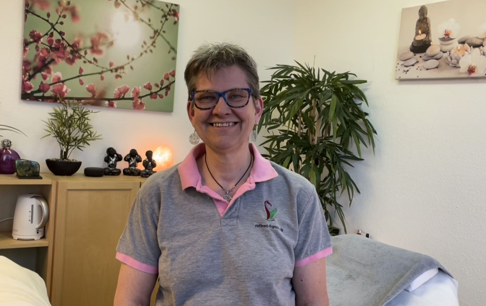
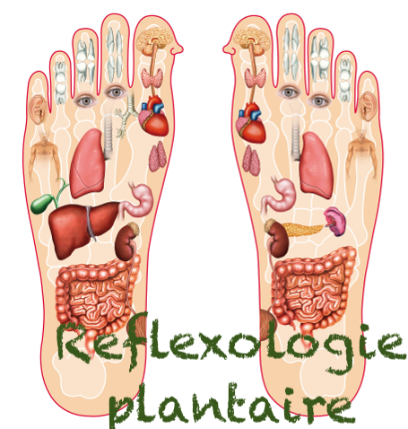
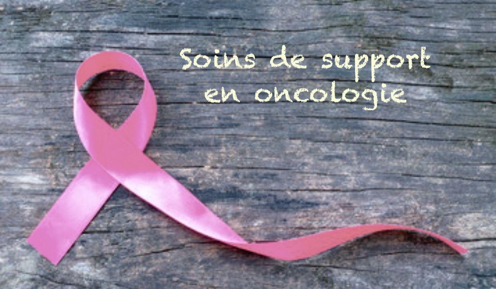
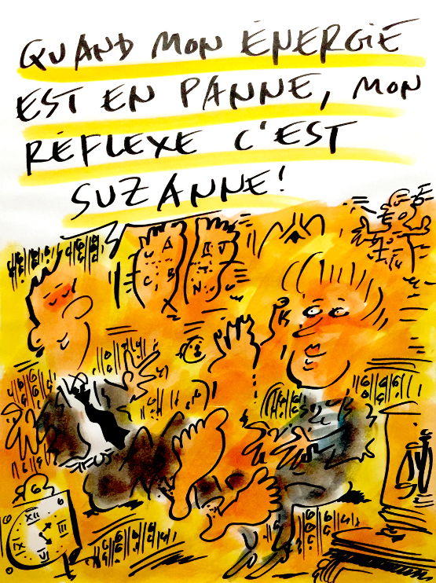

# Réflexo Lignon

## Bienvenue




#### Le cabinet sera fermé du 25 décembre au 5 janvier inclus, j'en profite pour vous souhaiter de très belles fêtes de fin d'année

## Suzanne Himmelberger
### Réflexologue diplômée, agréé ASCA ###

[{: style="margin-top:50px;margin-bottom:50px;" }](./presentation)

**J'aide les personnes souffrant d'inconforts en lien avec le stress à soulager les tensions liées aux maux du quotidien, à lâcher prise, et à retrouver un meilleur équilibre général par la réflexologie plantaire.**

Cliquez sur les images et les liens pour + d'informations

#### Réflexologie thérapeutique

[{: style="margin-top:20px; margin-bottom:20px; width:357px" }](./reflexologie)

❧

#### D'autres soins de réflexologie que je propose :
 
[Reflexo-Dos](./autres reflexologies) — La réflexologie combinée avec le massage assis.

[La réflexologie de la boîte crânienne](./autres reflexologies) permet de soulager insomnies, stress, préoccupations et autres.

❧

J'ai suivi une formation de **réflexologie en oncologie**, il s’agit d’un soin de support pour accompagner les personnes atteintes du cancer en soulageant les douleurs et effets secondaires des traitements.

[{: style="margin-top:20px; margin-bottom:20px; width:357px" }](./oncologie)

❧

#### Massage Hakim

[{: style="margin-top:10px; margin-bottom:10px; width:357px" }](./massages)

❧

## Une idée de cadeau originale 

Commandez votre "bon cadeau" en ligne !

[{: style="margin-top:20px; margin-bottom:20px; width:357px" }](./bons-cadeaux)

## Témoignage

*Une heure de pure détente suivie de nombreux jours soulagée de mes petits bobos. Suzanne a des doigts de fée, un vrai bonheur, même quand elle touche un point sensible, le soulagement et le bien-être arrivent très vite. Merci Suzanne.*

[Autres témoignages](./temoignages)

## Bon à savoir

Étant une spécialiste agréée par l’[*ASCA*](http://www.asca.ch/dc.aspx?content=Assureurs_conventionnes), mes séances sont remboursées par certaines assurances complémentaires.

**La réflexologie ne remplace en aucun cas un traitement médical, et ne peut en aucun cas se substituer à la prise en charge d’un médecin en cas de maladie grave. Elle permet un accompagnement en parallèle.**

[{: style="margin-top:20px; margin-bottom:20px; width:150px" }](./horaires & tarifs)

Au plaisir de vous rencontrer,

[Suzanne Himmelberger](./presentation)
37 Avenue du Lignon
1219 Le Lignon (Genève)
Suisse
[reflexolignon@gmail.com](mailto:reflexolignon@gmail.com)
<i class="fa fa-mobile"></i> +41 78 946 48 88



{: style="margin-top:40px;margin-bottom:100px;width:350px" }

❧







