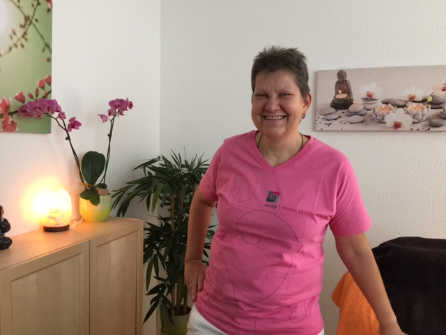
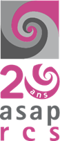
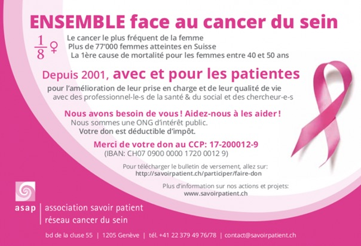

# Action Octobre Rose 2021

Pour la 6e année consécutive, Reflexo Lignon soutient le Réseau Cancer du Sein [*Association savoir patient*](http://www.savoirpatient.ch)

{: width="400" }

Je soutiens le Réseau Cancer du Sein qui fête ses 20 ans cette année, et pour la sixième année consécutive, je m'engage à leur reverser le 10% de mon chiffre d'affaire du mois d’octobre.
Le prix d'une séance de 60 minutes est de CHF 100.-

Le cancer du sein en Suisse : estimation 2018, uniquement cancers du sein invasifs :

17 femmes par jour
6'000 femmes par an
90'000 femmes atteintes
900'000 proches concernés
33% des cancers de la femme
40% des cancers de la femme jeune
1'400 décès par an 
1ère cause de mortalité féminine entre 40 et 50 ans
1 femme sur 8 y sera confrontée pendant sa vie

Soyez très nombreux et nombreuses à réserver une séance, et en plus de vous faire du bien, vous participerez au soutien de cette association qui me tient à coeur.

Un très grand MERCI par avance.
Suzanne

{: style="margin-top:20px;margin-bottom:100px;width:200px" }

{: style="margin-top:20px; margin-bottom:20px; width:200px" }




