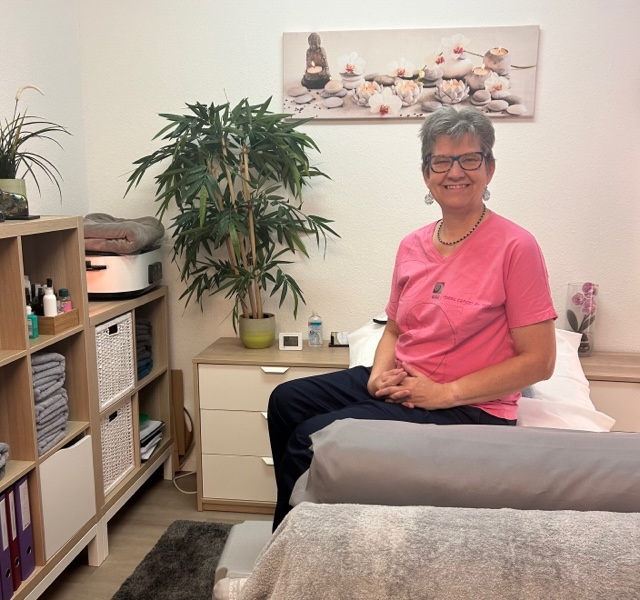
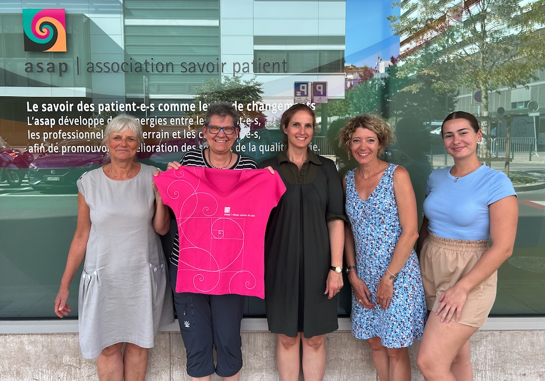

# Action Octobre Rose 2026

Comme chaque année au mois d'octobre, Reflexo Lignon soutient le Réseau Cancer du Sein [*Association savoir patient*](http://www.savoirpatient.ch)

{: width="400" }

Le cancer du sein en Suisse 
(Uniquement cancers du sein invasifs)
Chiffres OFS 2016-2020

17 femmes par jour
6'500 femmes par an
20% ont moins de 50 ans
5% ont moins de 40 ans
1'400 décès par an 
1ère cause de mortalité féminine entre 40 et 50 ans

Je soutiens cette association pour la onzième année consécutive, et je m'engage à leur reverser le 10% de mon chiffre d'affaire du mois d'octobre. Le prix d'une séance de 60 minutes est de CHF 100.-.

Soyez très nombreux et nombreuses à réserver une séance, et en plus de vous faire du bien, vous participerez au soutien de cette association qui me tient à coeur.

{: width="400" }

Un très grand MERCI par avance.
Suzanne




