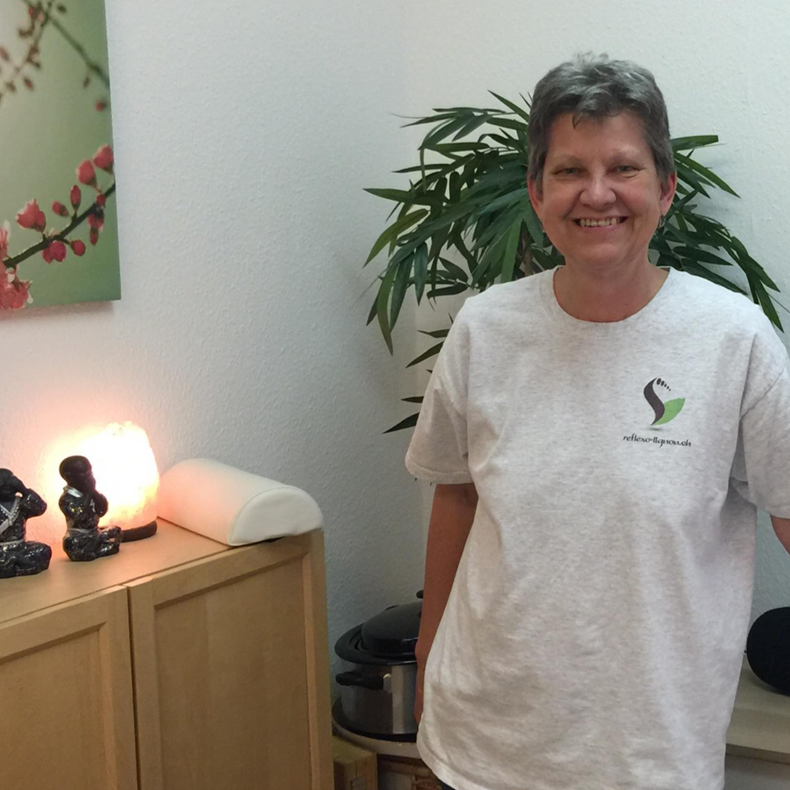

# Je me présente

{: width="400" }

Je m'appelle Suzanne Himmelberger, et j'ai découvert la réflexologie plantaire dans le milieu des années 2000 en tant que cliente. 
J'avais eu une très mauvaise fracture au niveau de la cheville en 1988. Depuis, ce pied me fait toujours plus ou moins souffrir, les sensations ne sont plus les mêmes, j'ai appris à vivre avec.... 
Lorsque je reçois des séances de réflexologie, c'est un vrai bonheur pour mes pieds, j'ai l'impression que mon pied respire et revit à nouveau. 

Puis en 2012, j'ai été touchée par la maladie, un cancer du sein, comme une femme sur 8 actuellement. Résultat : plusieurs mois de traitements lourds et assez difficiles à supporter. A ce moment-là également, la réflexologie m'a apporté beaucoup de mieux-être, et à me sentir plus apaisée. C'est en "sortant" de cette maladie, que j'ai décidé de faire une formation complète de réflexologie, afin que je puisse également accompagner et soutenir les personnes qui se retrouvent en souffrance.

Suite à une restructuration dans l’entreprise où j’ai travaillé, je peux réaliser un rêve : vivre d’une activité qui me passionne, et j’ai pu ouvrir mon propre cabinet de réflexologie en septembre 2016, que je me réjouis de vous faire découvrir.

Ma mission aujourd'hui est d’aider les personnes souffrant d’inconforts en lien avec le stress à soulager les tensions, les maux du quotidien, à lâcher prise, et à retrouver un meilleur équilibre général par la réflexologie plantaire.




