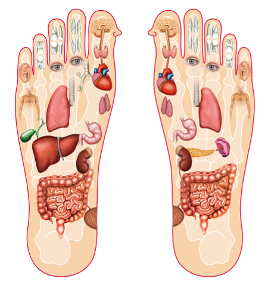

# Qu’est-ce que la réflexologie plantaire ?

La réflexologie plantaire est une thérapie, et une science qui part du principe qu’il y a dans les pieds et les mains des zones correspondant aux différents organes (foie, cœur, poumons, reins…) et aux différents systèmes (hormonal, nerveux, digestif…). Cette thérapie, douce, consiste à exercer des pressions sur les différentes zones, et permet de soulager de nombreux maux du quotidien. Pourtant, il ne faut pas forcément être malade pour en ressentir les bénéfices… la réflexologie apporte d’énormes bienfaits que l’on souffre de troubles ou non !

*Sur quels types de problèmes la réflexologie peut-elle agir ?*

La réflexologie stimule les capacités d’auto-guérison du corps. Elle permet de nettoyer l’organisme en évacuant les déchets, et de ce fait permet à l’énergie vitale de circuler librement.

Même lorsque l’on se sent bien, il est toujours utile d’éliminer régulièrement les déchets de son corps pour se sentir en pleine forme.

La réflexologie aide à éliminer les tensions, à rééquilibrer le système nerveux. Elle agit également sur le stress qui est à l’origine de nombreux troubles fonctionnels, tels que migraines, maux d’estomac, douleurs dorsales et cervicales, sinusites, constipation, etc.

Elle est très utile également dans l’accompagnement des maladies chroniques, cancers, troubles de l’humeur, et dépressions.

### Un peu d’histoire

Une forme de réflexologie existait déjà du temps des pharaons ainsi que dans les médecines traditionnelles chinoises et indienne, il y a quelques milliers d’années. Elle y est d’ailleurs toujours pratiquée.

La réflexologie contemporaine repose sur les recherches, au début du XXe siècle, du Dr Fitzgerald, mais c’est surtout à son assistante, l’américaine Eunice Ingham, dans les années 1930, que nous devons sa forme actuelle.
