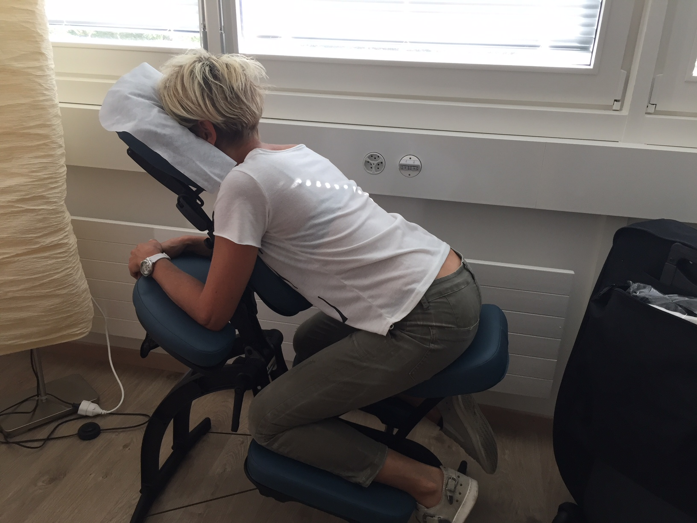
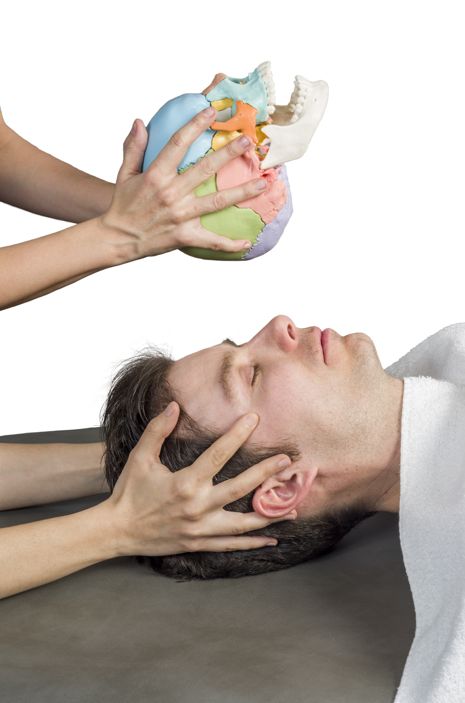

# Autres réflexologies

### Reflexo-dos

La réflexologie plantaire ou crânienne combinée avec le massage assis.

{: width="400" }

Le massage AMMA ASSIS se traduit par "calmer avec les mains". La personne est assise sur une chaise dont d'ergonomie spécifique s'adapte à toutes les morphologies, et permet un lâcher-prise très rapide. Le toucher s'effectue à travers les vêtements, ce qui sécurise ceux qui se font masser pour la première fois. Il n'y a donc en principe pas d'utilisation d'huile ou de crème. Dans la pratique du massage assis, la technique utilisée est une stimulation exercée par des pressions sur des points sensibles appelés "Tsubos", le long des lignes méridiens suivant la tête, la nuque, les épaules, le dos, les hanches, les bras et les mains.
Cette technique traditionnelle de wellness reste la plus répandue au Japon, et tient une position importante dans le vaste choix des méthodes dites de bien-être.

{: width="400" }

### La réflexologie de la boîte crânienne

Principales indications : insomnies, stress, préoccupations.... ou simplement pour le bien-être
Il s’agit d’une technique douce apportant beaucoup de bien-être au niveau de la tête.
Ce massage comprend différentes manœuvres, pressions, et mobilisations :
- La digitopressure, manœuvre apaisante et tonifiante, permettant le déblocage des courants d’énergie vitale
- La mobilisation de la boîte crânienne pour un effet libérateur profond
- Le décollement du cuir chevelu, se fait tout en douceur pour une meilleure irrigation des racines capillaires et du cuir chevelu. Le stress et l’anxiété ont une incidence sur la qualité de notre cuir chevelu (pellicules, irritations diverses, psoriasis, desquamation, chute de cheveux) mais également les maladies auto-immunes, la prise de certains médicaments, sans compter le stress amené par ces pathologies elles-mêmes.
- Le drainage de la lymphe, augmentation de l’effet de prévention par le passage de la lymphe dans les cellules de nettoyage que sont les ganglions
- Le traitement du bord de l’occiput, pour un effet d’allègement de la nuque, et préventif de l’arthrose
La mobilisation des pavillons des oreilles, pour un effet de dégagement du canal auditif, et une prise de conscience de l’équilibre

{: style="margin-top:20px; margin-bottom:20px; width:200px" }

### Points de Knap

Il s’agit d’une méthode qui agit par la stimulation de certains points musculaires répartis sur tout le corps. L’effet est global et permet de dénouer les tensions présentes. Appliquée régulièrement, elle élimine toutes les sortes de douleurs, et augmente la vitalité. Le corps devient plus équilibré, plus résistant, et les points douloureux de plus en plus rares.
Les points de la tête permettent de soulager de nombreux symptômes, tels que des céphalées, névralgies, sinusites, rhumes, douleurs de l’oreille, otites, douleurs de la nuque, etc… 

**La réflexologie ne remplace en aucun cas un traitement médical, et ne peut en aucun cas se substituer à la prise en charge d’un médecin en cas de maladie grave. Elle permet un accompagnement en parallèle**


