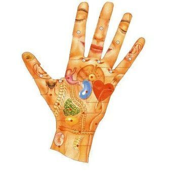
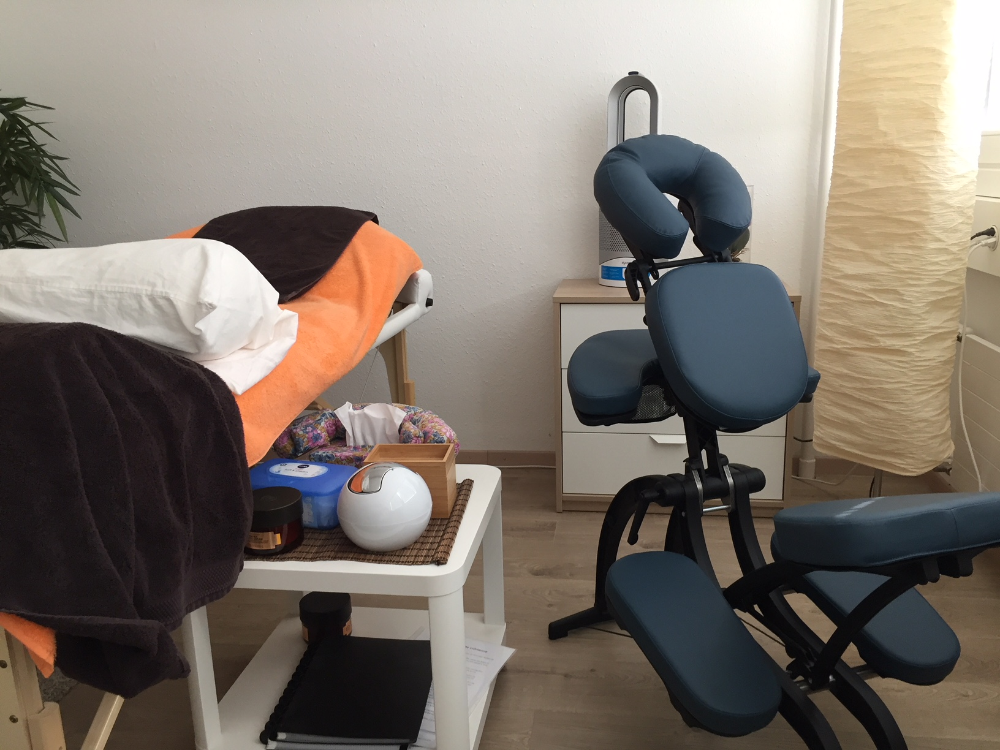
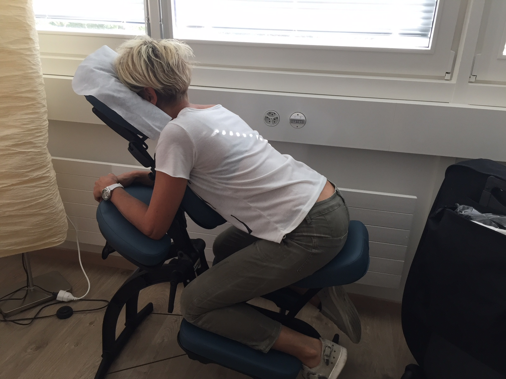
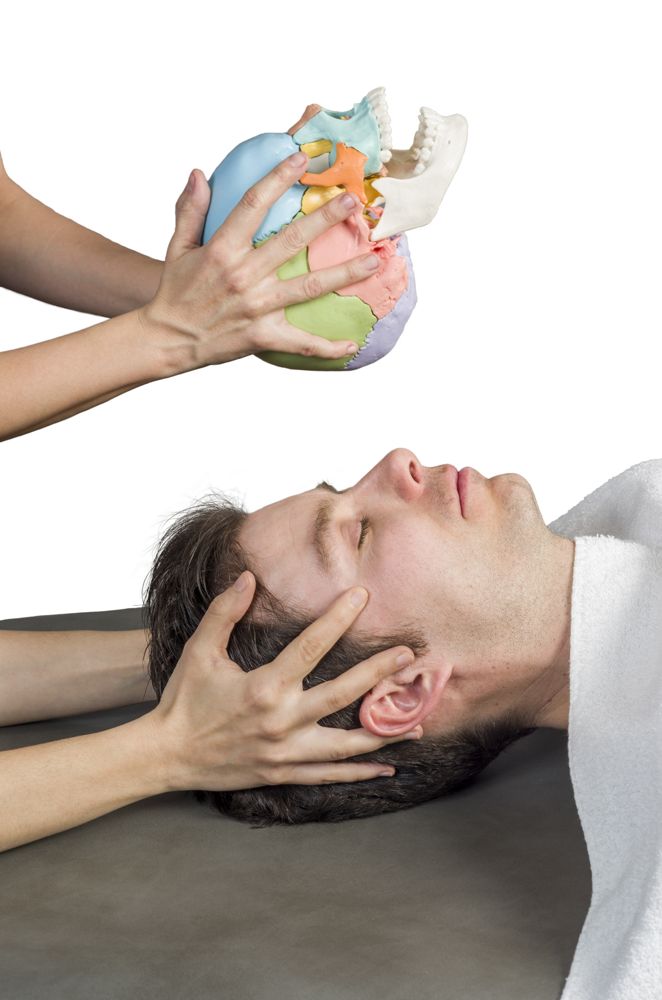
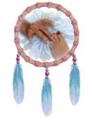

# Autres soins

### Réflexologie palmaire

Il ne s’agit pas que d’un simple massage des mains. C’est une réflexologie qui mériterait d’être beaucoup plus connue ! Les bienfaits sont très nombreux. Généralement pratiquée sur une table de massage, elle apporte une grande détente, est très efficace pour se relaxer et éliminer toutes les tensions accumulées. Elle permet également de soulager de nombreux maux du quotidien.
L’avantage de la réflexologie palmaire est qu’elle est beaucoup plus facile à faire lorsque l’accès au pieds est devenu difficile, par exemple pour les personnes âgées, ou handicapées, mais pas que…. Elle peut aussi être un excellent complément à la réflexologie plantaire, car elle permet de faire certains points en auto-massage.  
N’hésitez pas à tester la réflexologie palmaire, très agréable, relaxante, mais également très efficace. Une vraie et complète séance de réflexologie ! 

{: width="400" }

### Reflexo-dos

La réflexologie plantaire ou crânienne combinée avec le massage assis.

{: width="400" }

Le massage AMMA ASSIS se traduit par « calmer avec les mains ». La personne est assise sur une chaise dont d’ergonomie spécifique s’adapte à toutes les morphologies, et permet un lâcher-prise très rapide. Le toucher s’effectue à travers les vêtements, ce qui sécurise ceux qui se font masser pour la première fois. Il n’y a donc en principe pas d’utilisation d’huile ou de crème. Dans la pratique du massage assis, la technique utilisée est une stimulation exercée par des pressions sur des points sensibles appelés « Tsubos », le long des lignes des méridiens suivant la tête, la nuque, les épaules, le dos, les hanches, les bras et les mains.
Cette technique traditionnelle de *wellness* reste la plus répandue au Japon, et tient une position importante dans le vaste choix des méthodes dites de bien-être.

{: width="400" }

### La réflexologie de la boîte crânienne

Principales indications : insomnies, stress, préoccupations... ou simplement pour le bien-être
Il s’agit d’une technique douce apportant beaucoup de bien-être au niveau de la tête.
Ce massage comprend différentes manœuvres, pressions, et mobilisations :
- La digitopressure, manœuvre apaisante et tonifiante, permettant le déblocage des courants d’énergie vitale.
- La mobilisation de la boîte crânienne pour un effet libérateur profond.
- Le décollement du cuir chevelu se fait tout en douceur pour une meilleure irrigation des racines capillaires et du cuir chevelu. Le stress et l’anxiété ont une incidence sur la qualité de notre cuir chevelu (pellicules, irritations diverses, psoriasis, desquamation, chute de cheveux) mais également les maladies auto-immunes, la prise de certains médicaments, sans compter le stress amené par ces pathologies elles-mêmes.
- Le drainage de la lymphe, augmentation de l’effet de prévention par le passage de la lymphe dans les cellules de nettoyage que sont les ganglions.
- Le traitement du bord de l’occiput, pour un effet d’allègement de la nuque, et préventif de l’arthrose.
- La mobilisation des pavillons des oreilles, pour un effet de dégagement du canal auditif, et une prise de conscience de l’équilibre.

{: style="margin-top:20px; margin-bottom:20px; width:200px" }

### Points de Knap

Il s’agit d’une méthode qui agit par la stimulation de certains points musculaires répartis sur tout le corps. L’effet est global et permet de dénouer les tensions présentes. Appliquée régulièrement, elle élimine toutes les sortes de douleurs, et augmente la vitalité. Le corps devient plus équilibré, plus résistant, et les points douloureux de plus en plus rares.
Les points de la tête permettent de soulager de nombreux symptômes, tels que des céphalées, névralgies, sinusites, rhumes, douleurs de l’oreille, otites, douleurs de la nuque, etc.

### Réflexologie amérindienne

Tout, sauf ce à quoi on s’attend dans une réflexologie mais grâce à cela : bien plus que l’on osait espérer !

Les réflexologies sont de belles méthodes de soin. La réflexologie amérindienne spirituelle va plus loin et emploie surtout une porte d’entrée tout autre.

Elle permet un travail très en profondeur, un travail personnel intense par une revisite et un équilibrage de ses émotions, de sa pensée et de sa manière de laisser le monde nous influencer.

Nous entrons ici dans une façon de nous prendre en charge dont nous n’avons pas forcément l’habitude et nous ne pouvons pas décharger notre responsabilité vers des causes de nos malêtres ou maladies à l’extérieur de nous. Nous ne pouvons déresponsabiliser notre soin dans des pastilles. Nous voyageons. En nous. Pour nous. Pour notre mieux-être et notre évolution/développement.

Tout en douceur, rien d’agressivement intrusif, le soin est en les mains de celui qui le reçoit : c’est lui le véritable acteur et créateur de la séance. Le thérapeute n’est, comme il se doit, qu’une excuse pour ce que vivra le patient.

Facile comme tout, doux comme une caresse, beau comme un bijou, bon comme du chocolat et profond comme une pensée. Du plaisir à tous !

Marc Ivo Bohning, formateur, et auteur du livre : Réflexologie amérindienne spirituelle ou « points mexicains »

{: style="margin-top:20px; margin-bottom:20px; width:200px" }

**La réflexologie ne remplace en aucun cas un traitement médical, et ne peut en aucun cas se substituer à la prise en charge d’un médecin en cas de maladie grave. Elle permet un accompagnement en parallèle.**




