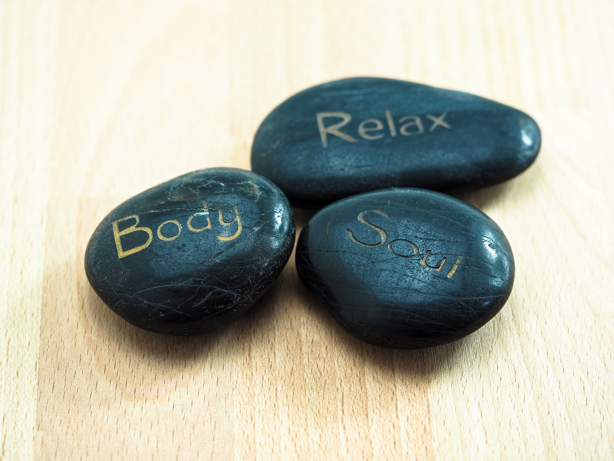

# Massage aux pierres chaudes

Découvrez la douceur des pierres volcanique et laissez-vous envelopper par une vague de chaleur. Ce soin conjugue les bienfaits d'un massage relaxant avec le travail en profondeur par les pierres qui diffusent une douce chaleur à tout l'organisme, et procurent une profonde sensation de bien-être et de relachement. 

### Les bienfaits du massage aux pierres chaudes sont multiples : 

- Soulage les tensions liées au stress
- Relâche les tensions musculaires
- Favorise la circulation sanguine et lymphatique
- Aide à éliminer les toxines
- Adoucit et assouplit la peau
- Procure détente et bien-être




