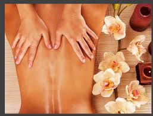

# Massage Hakim

Le massage "Hakim" est un massage énergétique du dos issu de la médecine derviche, connu en Suisse grâce au Dr Breuss. Il se pratique avec de l'huile de millepertuis et apporte du "soleil" dans la colonne vertébrale. L'huile pénètre jusque dans les disques et les nourrit.

Les manoeuvres douces, lentes et répétitives contribuent à :
Une détente globale et profonde.
Un étirement doux de la colonne, permettant ainsi le réalignement naturel des vertèbres.
Une libération des nerfs, des vaisseaux sanguins et lymphatiques, améliorant tous les échanges métaboliques.
Un rééquilibrage des structures neurovégétatives, sympathiques et parasympatiques agissant de façon positive sur les viscères et les organes.

[{: style="margin-top:20px; margin-bottom:20px; width:150px" }](./horaires & tarifs)




