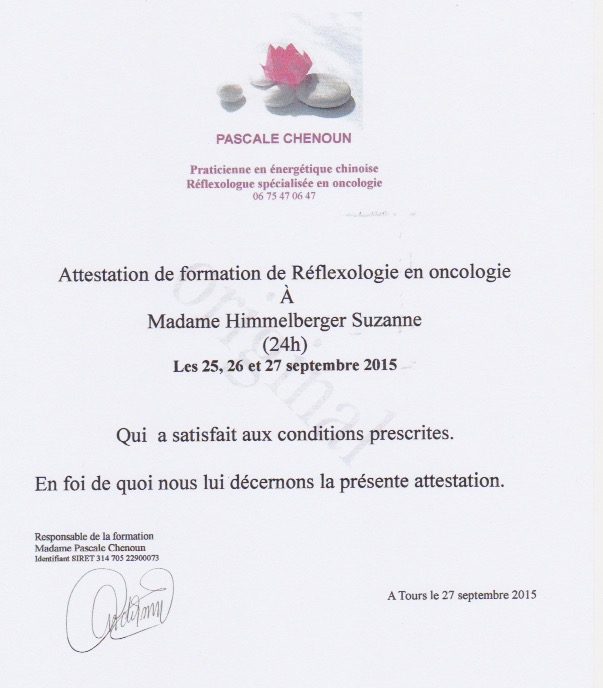

# La réflexologie en oncologie

{: width="400" }

Suite à ma formation en réflexologie, ayant été directement concernée par la maladie, j’ai choisi de faire une spécialisation en oncoréflexologie auprès de Pascale Chenoun qui pratique la réflexologie au Centre de cancérologie de l’hôpital de Tours en France.

**Il ne s’agit pas exactement d’une réflexologie "classique"**

Il s’agit d’une pratique particulière qui permet non seulement d’apaiser les tensions psychologiques créées par l’annonce de la maladie, mais également de soulager les douleurs provoquées par les effets indésirables et secondaires des traitements du cancer :

- nausées
- vomissements
- constipation
- diarrhée
- douleurs musculaires ou articulaires
- insuffisance rénale
- douleurs abdominales
- polynévrite
- vertiges, bourdonnements d’oreilles ou acouphènes

Elle redynamise également l’organisme souffrant par l’impulsion de la libre circulation des énergies.

Le principe est toujours de stimuler des points réflexes situés au niveau des pieds, mais en plus d’utiliser les mains, on utilise un stylet afin de stimuler des points très spécifiques du système nerveux en fonction de ce que l’on souhaite soulager. Il y a des protocoles particuliers en fonction des différents traitements de chimiothérapie.
Le stylet permet de cibler précisément des points de réflexologie dans le but de soulager des douleurs induites par les traitements de chimiothérapie et de radiothérapie.

Les séances peuvent se faire à mon cabinet, mais sachez que je me déplace également à domicile.
N’hésitez pas à me contacter pour de plus amples renseignements, et à en parler à votre oncologue.

[*Suzanne Himmelberger*](./contact)

{: width="400" }

**Quelques articles à propos de la réflexologie en oncologie :**

❧

**Attention, la réflexologie ne remplace en aucun cas un traitement médical, et ne peut en aucun cas se substituer à la prise en charge d’un médecin en cas de maladie grave. Elle permet un accompagnement en parallèle.**





