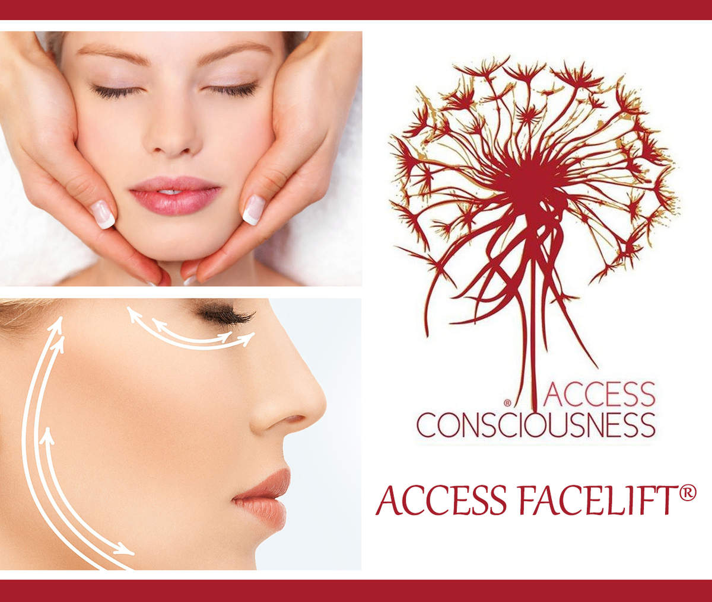

# Soins énergétiques

### Access Bars
 
Il s’agit d’un soin énergétique au cours duquel 32 points sont stimulés en douceur sur la tête.
Ce soin permet de libérer les blocages, peurs, pensées, jugements, émotions, et mémoires négatives qui ont été stockées dans le cerveau au fil du temps…
 
Je me réjouis de vous faire découvrir les « Bars d’Access »
[*Vidéo explicative*](https://www.youtube.com/watch?v=Cc4Kx6bJSvM) 

### Lifting facial énergétique

Le lifting facial énergétique est une technique spécifique d'Access Consciousness, pour le corps et l'esprit.
Sans aiguilles ni produits, donne un aspect "coup d'éclat" au visage. Répété une vingtaine de fois, l'effet semble permanent. Cette technique spécifique exercée sur le haut du buste, la nuque, le cou, le visage et le crâne a un effet extrêmement relaxant sur le corps en entier. 

{: style="margin-top:20px; margin-bottom:20px; width:200px" }

### Réflexologie amérindienne

Tout sauf à quoi on s'attend dans une réflexologie mais grâce à celà : bien plus que l'on osait espérer !

Les reflexologies sont de belles méthodes de soin. La réflexologie amérindienne spirituelle va plus loin et emploie surtout une porte d'entrée toute autre.

Elle permet un travail très en profondeur, un travail personnel intense par une re visite et un équilibrage de ses émotions, de sa pensée et dde sa manière de laisser le monde nous influencer. 

Nous entrons ici dans une façon de nous prendre en charge dont nous n'avons pas forcément l'habitude et nous ne pouvons pas décharger notre responsabilité vers des causes de nos mal-êtres ou maladies à l'extérieur de nous. Nous ne pouvons déresponsabiliser notre soin dans des pastilles. Nous voyageons. En nous. Pour nous. Pour notre mieux être et notre évolution/développement.

Tout en douceur, rien d'agressivement intrusif, le soin est en les mains de celui qui le reçoit : c'est lui le véritable acteur et créateur de la séance. Le thérapeute n'est, comme il se doit, qu'une excuse pour ce que vivra le patient.

Facile comme tout, doux comme une caresse, beau comme un bijou, bon comme du chocolat et profond comme une pensée. Du plaisir à tous !
Marc Ivo Bohning, formateur, et auteur du livre : Réflexologie amérindienne spirituelle ou "points mexicains"

{: style="margin-top:20px; margin-bottom:20px; width:200px" }





