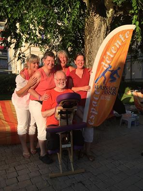
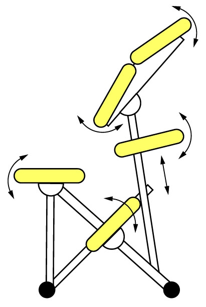

# Massage assis & Réflexologie au Montreux-Jazz festival.

### Du 1.07.2016 au 16.07.2016

Je fais partie d'un groupe de thérapeutes indépendants, et nous nous regroupons spécialement pour vous pendant toute la durée des festivités du Montreux-Jazz au mois de juillet.
Notre Espace Détente se situe au Parc Filletaz, au beau milieu du festival off.

Nous vous proposons des séances de
Massage Assis:
Le AMMA ASSIS se traduit par « calmer avec les mains"
La personne est assise sur une chaise dont l’ergonomie spécifique s’adapte à toutes les morphologies, et permet un lâcher prise très rapide.
Le toucher s’effectue à travers les vêtements, ce qui sécurise ceux qui se font masser pour la première fois. (il n’y a donc pas d’utilisation d’huile ou de crème)
Dans la pratique du Massage Assis, nous utilisons la stimulation exercée par une pression sur des points sensibles appelés Tsubos, le long des lignes méridiens suivant la tête, la nuque, les épaules, le dos, les hanches, les bras, les mains.

Le Amma Assis peut être pratiqué en tout lieu, car il ne nécessite que de peu d’espace et s'adapte à l'environnement:
=> Lieux de travail /Events / Lancement de produits / Festivals ...

Cette technique traditionnelle de wellness reste la plus répandue au Japon, et tient une position importante dans le vaste choix des méthodes dites de Bien-être.

### Pour votre bien-être et le bonheur de vos pieds, nous proposons également des séances de réflexologie
