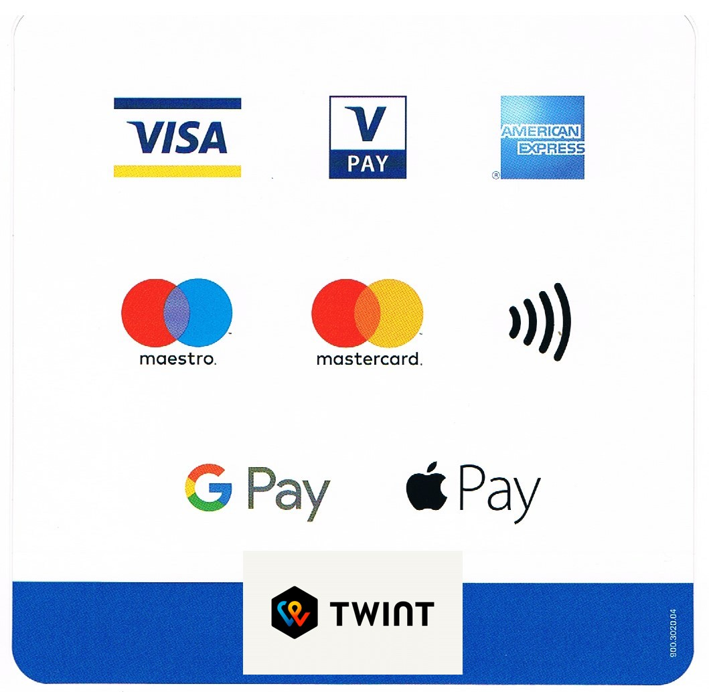

# Horaires & Tarifs

#### Le cabinet est ouvert du lundi au vendredi de 11h à 20h ####

❧

## Réflexologies

### Séances réflexologie (60 min)
- Réflexologie plantaire (bien-être et thérapeutique)
- Réflexologie de la tête aux pieds (réflexologie de la boîte cânienne et réflexologie plantaire)
- Réflexo-dos
**CHF 100.- la séance de 60 minutes**

### Séances réflexologie (75 min)
- Réflexologie plantaire
- Réflexologie de la tête aux pieds (réflexologie de la boîte cânienne et réflexologie plantaire)
- Réflexo-dos
**CHF 120.- la séance de 75 minutes**

### Séances réflexologie (90 min)
- Réflexologie de la tête aux pieds (réflexologie de la boîte cânienne et réflexologie plantaire)
- Réflexo-dos
- Réflexo-dos + tête aux pieds
**CHF 140.- la séance de 90 minutes**

### Réflexo en oncologie
Les séances d’oncoréflexologie peuvent être plus courtes,
le prix est adapté en conséquence.

### Réflexologie amérindienne (60 min)
**CHF 100.- la séance de 60 minutes**

❧

## Massage Hakim
**CHF 120.- la séance de 70 minutes**

❧

## Bons cadeaux

**Pensez à vos proches et à vos amis,**
**offrez-leur une séance de réflexologie.**

Nouveau : Commandez votre "bon cadeau" en ligne !

[{: style="margin-top:20px; margin-bottom:20px; width:357px" }](./bons-cadeaux)

❧

**En cas de modification ou annulation d'un rendez-vous, je vous remercie de m’en informer au plus tard un jour ouvrable à l’avance.** 

{: width="250" }




