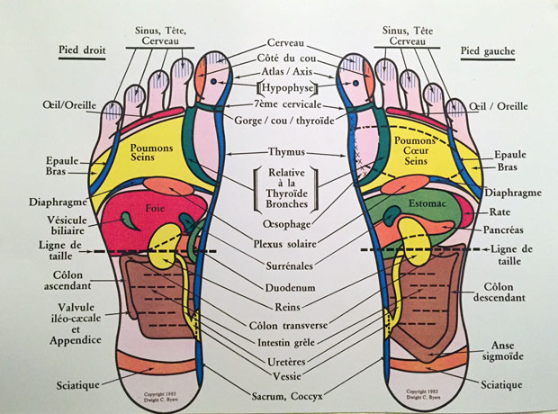

# Site web de Suzanne

Bienvenue

Je m’appelle Suzanne Himmelberger, et j’exerce la réflexologie au Centre Ocinquième Sens,  11 rue du Grand-Bureau, 1227 Acacias-GE
Tél. 078 880 17 18

Prenez le temps de découvrir  sur ce site les différents aspects de la réflexologie que je pratique

Au plaisir de vous rencontrer

Suzanne Himmelberger

# Présentation

Mon histoire :

Depuis le milieu des années 90, je suis devenue une grande adepte des thalassothérapies, et tous les soins qui vont avec.
Ayant eu une mauvaise fracture à un pied, j’étais toujours à la recherche de thérapies qui pouvaient m’apporter un mieux-être.
Je travaille dans une grande entreprise, et j’ai toujours été attirée par une petite activité dans le bien-être.
J’ai alors découvert le massage amma-assis en 2007, et je pratique occasionnellement ce massage lors de manifestiations.
Puis j’ai découvert la réflexologie, d’abord pour le bien-être de mes pieds. Mais la réflexologie amène bien plus que celà.
En 2012, j’ai été confrontée à la maladie, et j’ai eu une grande remise en question. A ce moment là, j’ai décidé de faire une formation sérieuse en réflexologie, je me suis donc inscrite à l’école HP formation à Genève, ou j’ai obtenu mon diplôme de réflexologue.
Puis j’ai complété cette formation avec un cours de réflexologie thérapeutique, puis j’ai également suivi un cours d’onco-réflexologie, une formation qui me tenait à cœur, car je vais pouvoir aider des personnes en traitement de chimiothérapie et radiothérapie à mieux supporter leur traitements, sans compter le soutien psychologique par le biais du toucher que peut amener la réflexologie.

# Formations

Massage amma-assis :  Touchline  Genève 2007
Massage amma-allongé : Touchline Genève 2008
Réflexologie plantaire : HP Formation Genève, 2013 – 2015
Réflexologie thérapeutique : HP formation Genève, 2015
Onco-réflexologie : Pascale Chenoun, F-Tours, 2015

Liens :

Réflexologie – massages :

Centre Ocinquieme Sens  : <http://www.ocinquieme.ch>

Réflexologie – massages – Fleurs de Bach

Harmonie Santé , France Riondel: <http://www.harmoniesante.ch>

Réflexologie – Massages – Hypnose

Catherine Joerg : <http://catherinejorg.ch>

EFT – TBT, Gestion du stress

Isabelle Levrat : <http://eft-tbt.com>

Développement personnel grâce au cheval

Alicia Manzoni : <http://www.equi-liberta.ch>

Géobiologie

L’Or vert de la Gruyère, Véronique Matter : <http://www.orvert.ch>

# Qu’est-ce que la réflexologie ?

La réflexologie plantaire est une thérapie, et une science qui part du principe qu’il y a dans les pieds et les mains des zones correspondant qus différents organes (foie, cœur, poumons, reins…) et aux différents systèmes (hormonal, nerveux, digestif…), et qui permet de soulager de nombreux petits maux du quotidien ; pourtant, il ne faut forcément être malade pour en ressentir les bénéfices… la réflexologie apporte d’énormes bienfaits qu’on souffre de troubles ou non !

# Sur qules types de problèmes, la réflexologie peut-elle agir ?

En premier lieu, les problèmes de stress. Environ 75 % des troubles fonctionnels (constipation, migraines, mal de dos…) sont dus aux tensions qu’engendre le stress.

De bons résultats également pour calmer la nervésité, les insomnies, les problèmes digestifs, la constipation, les troubles féminin, les maux de tête, les douleurs vertébrales,  les jambes lourdes.

La réflexologie stimule également les capacités d’auto-guérison du corps

La réflexologie permet également de nettoyer l’organisme en évacuant les déchets et en faisant circuler correctement l’énergie vitale. Même lorsqu’on se sent bien, il est toujours utile d’éliminer régulièrement les déchets de son corps pour se sentir en pleine forme.

La réflexologie en oncologie

Suite à ma formation en réflexologie, ayant été directement concernée par la maladie, j’ai choisi de faire une spécialisation en onco-réflexologie auprès de Pascale Chenoun qui pratique la réflexologie au Centre de cancérologie de Tours.

Cette pratique permet d’apaiser les tensions psychologiques créées par l’annonce de la maladie, de soulager les douleurs ptovoquées par les effets indésirables et secondaires des traitements de chimiothérapie:

- nausées
- vomissements
- constipation
- diarrhée
- douleurs musculaires et/ou articulaires
- insuffisance rénale
- douleurs abdominales
- polynévrite

Elle redynamise également l’organisme souffrant par l’impulsion de la libre circulation des énergies.

Voici quelques liens d’articles sur internet :

http://www.passeportsante.net/fr/Therapies/Guide/Fiche.aspx?doc=reflexologie_th

http://www.actmd.org/articles/200902reflexosoinspalliatifsf.htm
La réflexologie ne remplace en aucun cas un traitement médical, elle permet un accompagnement en parallèle.
